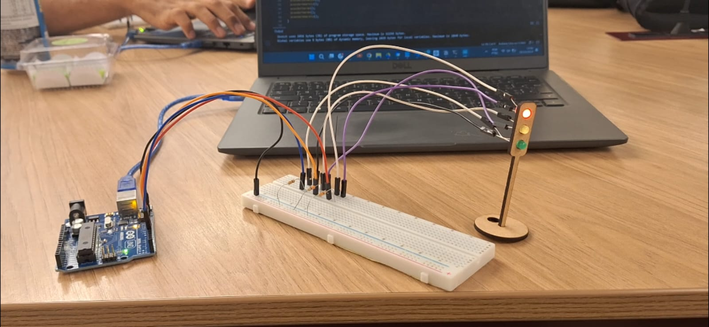
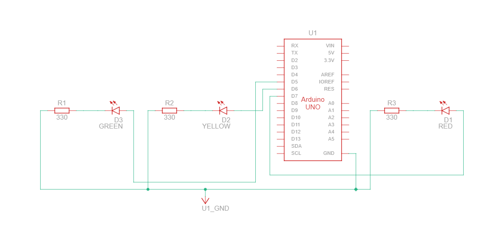

# Semáforo Offline

## Montagem Física

Figura 1 - Montagem Física

Fonte: Material produzido pelos autores (2024)

&nbsp;&nbsp;&nbsp;&nbsp;A montagem foi realizada em uma *protoboard* e com um suporte em MDF, simulando um semáforo. Cada LED foi conectado a uma porta do Arduino, além de estar em série com resistores, os quais estão conectados ao GND do Arduino. Dessa forma, O Arduino é responsável por alternar o acendimento e o apagamento dos LEDs na sequência estipulada. 
   
#### Tabela de Componentes Utilizados

| Componente | Quantidade | Especificações |
|------------|------------|------------|
| Arduino Uno  | 1          | |
| LED Vermelho | 1          | 5mm, 2V, 20mA
| LED Amarelo  | 1          | 5mm, 2V, 20mA |
| LED Verde    | 1          | 5mm, 2V, 20mA|
| Resistor     | 3          | 330 Ω|
| Protoboard   | 1          | |
| Jumpers      | Diversos   ||

### Circuito

Figura 2 - Circuito

Fonte: Material produzido pelos autores (2024)

1. **LED Verde (D3)**:
   - O LED verde está conectado ao pino D7 do Arduino.
   - Há um resistor de 330 ohms (R1) em série com o LED, que protege o LED.
   - O outro terminal do resistor vai para o GND (terra) do Arduino.

2. **LED Amarelo (D2)**:
   - O LED amarelo está conectado ao pino D6 do Arduino.
   - Um resistor de 330 ohms (R2) está em série com este LED.
   - O terminal do resistor está ligado ao GND, completando o circuito para o LED amarelo.

3. **LED Vermelho (D1)**:
   - O LED vermelho está ligado ao pino D5 do Arduino.
   - Um resistor de 330 ohms (R3) também está em série para proteger o LED.
   - O outro terminal do resistor está conectado ao GND do Arduino.

### Código
&nbsp;&nbsp;&nbsp;&nbsp;O código, disponível [aqui](./semaforo.ino), implementa o funcionamento de um semáforo usando o Arduino. Ele define três portas para controlar LEDs. 

1. **Configuração dos pinos e intervalos**: São declarados pinos específicos para cada LED, junto com o tempo (em milissegundos) que cada um ficará aceso.

2. **Funções para cada cor**:
   - `acenderVermelho()`: Acende o LED vermelho e apaga os outros por 6 segundos.
   - `acenderAmarelo()`: Acende o LED amarelo e apaga os outros por 2 segundos.
   - `acenderVerde()`: Acende o LED verde e apaga os outros por 2 segundos.

3. **Função `setup()`**: Configura os pinos como saídas, permitindo que o Arduino controle o estado dos LEDs.

4. **Função `loop()`**: Executa continuamente as funções para acender os LEDs, repetindo-o indefinidamente. A sequência de cores é a seguinte: vermelho, amarelo, verde, verde (repete o verde), amarelo, e então volta ao vermelho, recriando o ciclo de um semáforo.

## Evidências

- **Foto da Montagem Física**: [Protoboard com LEDs montados](./foto_semaforo.jpg)
- **Vídeo Demonstrativo**: [Vídeo do funcionamento do semáforo](./video_semaforo.mp4)

## Avaliação em pares

### Avaliador: Felipe Zillo

| Critério                                                                                                 | Contempla (Pontos) | Contempla Parcialmente (Pontos) | Não Contempla (Pontos) | Observações do Avaliador |
|---------------------------------------------------------------------------------------------------------|--------------------|----------------------------------|--------------------------|---------------------------|
| Montagem física com cores corretas, boa disposição dos fios e uso adequado de resistores                | 3              |                             |                        |                           |
| Temporização adequada conforme tempos medidos com auxílio de algum instrumento externo                  | 3              |                       |                        |                           |
| Código implementa corretamente as fases do semáforo e estrutura do código (variáveis representativas e comentários) | 3              |                          |                         |                           |
| Extra: Implmeentou um componente de liga/desliga no semáforo e/ou usou ponteiros no código | 1              |                          |                        |  Semáforo em pé                         |
|  |                                                             |  | |**Pontuação Total**: 10|

### Avaliador: Daniel Gonçalves

| Critério                                                                                                 | Contempla (Pontos) | Contempla Parcialmente (Pontos) | Não Contempla (Pontos) | Observações do Avaliador |
|---------------------------------------------------------------------------------------------------------|--------------------|----------------------------------|--------------------------|---------------------------|
| Montagem física com cores corretas, boa disposição dos fios e uso adequado de resistores                | 3              |                            |                         |                           |
| Temporização adequada conforme tempos medidos com auxílio de algum instrumento externo                  | 3              |                          |                        |                           |
| Código implementa corretamente as fases do semáforo e estrutura do código (variáveis representativas e comentários) | 3              |                          |                        |                           |
| Extra: Implmeentou um componente de liga/desliga no semáforo e/ou usou ponteiros no código | 1              |                          |                        |                           |
|  |                                                             |  | |**Pontuação Total**: 10|
